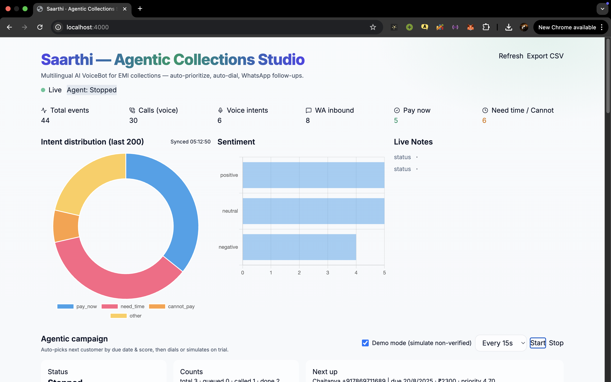
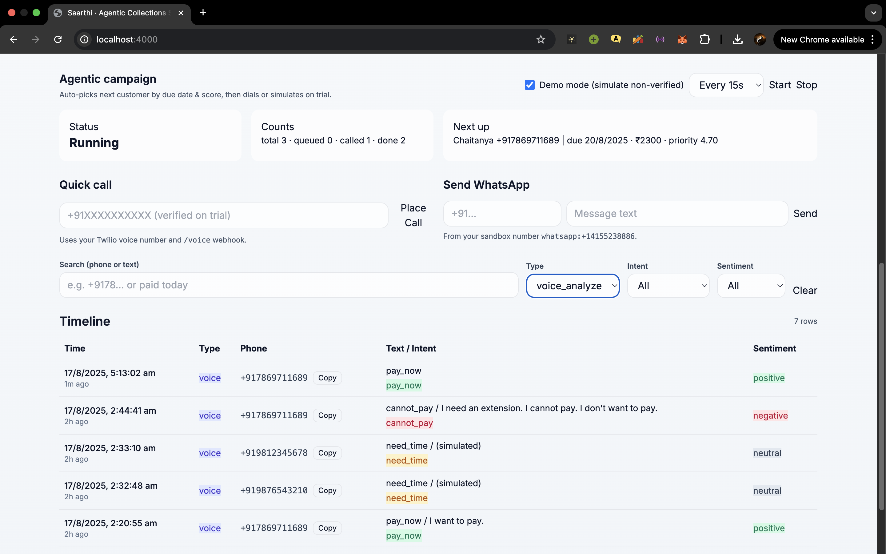
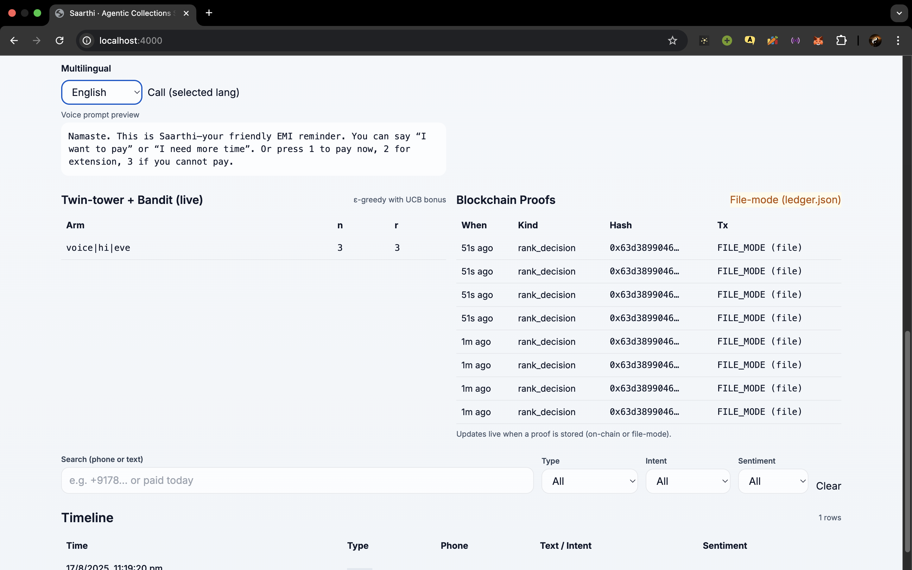
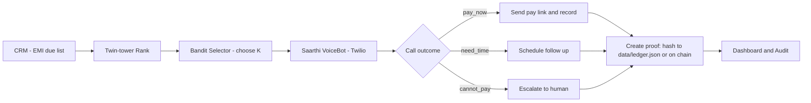

# 🎙️ Saarthi — Agentic Collections Studio

**Saarthi** is a **multilingual AI VoiceBot** for **EMI collections & payment reminders**.  
It auto-prioritises customers, auto-dials via Twilio, detects intent + sentiment, and follows up with **WhatsApp messages and secure pay links**.

> **Built for the TVS Credit E.P.I.C 7.0 IT Challenge** — *“Agentic VoiceBots for EMI Collections/Payments.”*

---

## ✨ Key Features
- 🔄 **Agentic workflow** — selects and prioritises borrowers by due date, risk score and live feedback  
- 🗣️ **Multilingual calls** — voice prompts in multiple languages with preview in the dashboard  
- 🧠 **Twin-tower ranking + Bandit selector** — twin-tower model (customer + campaign features) for ranking; contextual bandit for exploration/exploitation when picking callers  
- 📞 **Twilio voice calls** — auto-dial, IVR options and DTMF capture  
- 💬 **WhatsApp follow-ups** — automated follow-ups and secure pay links (no card data stored on our servers)  
- 🤖 **OpenAI NLP** — intent classification (`pay_now`, `need_time`, `cannot_pay`) + sentiment analysis to route outcomes  
- 🔗 **Blockchain proofs (tamper-proof ledger)** — store key event hashes (rank decisions, call outcomes, payments) to `data/ledger.json` (file-mode) or on-chain  
- 📊 **Live dashboard** — twin-tower + bandit live table, intent donut, sentiment bars, campaign timeline  
- ☁️ **Cloud-ready & scalable** — containerised, API-first design

---

## 🖼️ Screenshots (stacked / vertical)
> Place the image files under `public/` or repo root. This README uses the exact filename you uploaded: `screenshot_chain.png`.

<p align="center">
  
</p>

<p align="center">
  
</p>

<p align="center">
  
</p>

---

## 🛠️ Tech Stack
| Layer     | Tech                                   |
|-----------|----------------------------------------|
| Front-end | React + TailwindCSS                    |
| Back-end  | Node.js + Express                      |
| Telephony | Twilio Voice & WhatsApp APIs           |
| AI / NLP  | OpenAI (intent & sentiment)            |
| Ranking   | Twin-tower model, Contextual Bandit    |
| Database  | MongoDB                                |
| Ledger    | File-mode `data/ledger.json` or on-chain |
| DevOps    | Docker-ready, Ngrok (dev)              |

---

## 🚀 Local Setup (single `README.md` copy-paste friendly)

> Follow these steps **in order**. All terminal commands are shown **without prompts** (pasteable).

### 1) Clone repository
```bash
git clone https://github.com/chaitanya21kumar/saarthi.git
cd saarthi
```

### 2) Create `.env` (root of repo)
Create a `.env` file and paste the contents below (update values):

```text
# --- Twilio ---
TWILIO_ACCOUNT_SID=your_account_sid
TWILIO_AUTH_TOKEN=your_auth_token
TWILIO_PHONE_NUMBER=+1234567890

# --- WhatsApp Sandbox ---
WHATSAPP_FROM=whatsapp:+14155238886

# --- Server ---
PORT=4000

# --- OpenAI (optional) ---
OPENAI_API_KEY=your_openai_key

# --- MongoDB ---
MONGODB_URI=mongodb://localhost:27017/saarthi

# --- Twin-tower / Bandit config (examples) ---
TWIN_MODEL_PATH=./models/twin_tower/
BANDIT_EXPLORATION=0.1

# Optional:
# LEDGER_PATH=./data/ledger.json
```

> **Important:** Do **not** commit `.env`. Ensure `.gitignore` includes `.env`.

### 3) Install dependencies
(adapt if your repo uses different folder names)

```bash
# frontend
cd frontend
npm install
# keep this terminal open for frontend dev server
```

```bash
# backend (open a new terminal)
cd ../backend
npm install
```

### 4) Run MongoDB (local)
Option A — local `mongod`:
```bash
mongod --dbpath /path/to/your/db
```

Option B — Docker:
```bash
docker run -d --name saarthi-mongo -p 27017:27017 -v mongodata:/data/db mongo:6
```

### 5) Prepare model & ledger
```bash
# ensure folders exist
mkdir -p models
mkdir -p data
# create a seed ledger (file-mode)
echo "[]" > data/ledger.json
```
(Adjust `LEDGER_PATH` in `.env` if you store ledger elsewhere.)

### 6) Start backend
From the backend folder:
```bash
# dev (recommended)
npm run dev

# or production
npm start

# or directly
node index.js
```

### 7) Start frontend
From the frontend folder:
```bash
npm run dev
# frontend typically at http://localhost:3000
```

### 8) Expose backend to Twilio (dev only)
```bash
ngrok http 4000
```

- Copy the generated HTTPS URL (e.g. `https://abcd1234.ngrok.io`) and set Twilio Voice webhook to:
```
https://<ngrok-id>.ngrok.io/voice
```

- For WhatsApp, point the webhook to your `/webhook/whatsapp` route or configured endpoint.

### 9) Quick test — dashboard & quick call
- Open dashboard (e.g. `http://localhost:4000` or frontend URL).  
- Use **Quick Call** to trigger a test call. Dashboard will show:
  - Twin-tower ranking rows (arms, `n`, `r`, scores)
  - Bandit decisions and updated counts
  - Ledger entries (file-mode) showing `when`, `kind`, `hash`, `tx`

### 10) Troubleshooting
- `EADDRINUSE` → change `PORT` in `.env` or kill the process using the port.  
- Twilio webhooks not hitting backend → ensure ngrok running, webhook updated in Twilio console, and endpoint path matches.  
- Model load errors → confirm `TWIN_MODEL_PATH` and model artifact formats.  
- DB connection errors → confirm `MONGODB_URI` and that `mongod` is running.  
- Ledger write errors → ensure `data/ledger.json` exists and backend process has write permissions.

### 11) Stop services
- Backend / frontend: `Ctrl+C` in terminals  
- Ngrok: `Ctrl+C`  
- Docker Mongo: `docker stop saarthi-mongo && docker rm saarthi-mongo`

---

## 🧩 Design notes — Twin-tower + Bandit + Ledger
- **Twin-tower model**: two encoders — *customer* tower (demographics, repayment history, risk) and *campaign* tower (campaign id, due age, comms history). Combine embeddings (dot product / similarity) → ranking score.
- **Bandit selector**: contextual bandit (epsilon-greedy / UCB / Thompson) chooses top-K to call; updates state (`n`, `r`, attempts) after each outcome to balance exploration and exploitation.
- **Ledger / proofs**: hash critical events (`rank_decision`, `call_outcome`, `payment_received`) and append `{when, kind, hash, tx}` to `data/ledger.json` (file-mode) or submit to on-chain contract for stronger guarantees.

---

## 📊 Workflow (high-level)
> This **Mermaid** block is valid and GitHub-friendly. I removed non-ASCII dashes and problematic characters and kept labels simple to avoid parser errors.



> If GitHub preview still shows *"Unable to render rich display"*, that is a renderer issue in your viewer or GitHub environment. The mermaid block above is syntactically valid for GitHub's supported mermaid syntax. If needed, enable GitHub's mermaid preview or use a browser mermaid extension. (No special unicode or non-ASCII characters are present in the block.)

---

## 📂 Example folder structure
```text
saarthi/
├─ backend/             # Express + Twilio handlers + model loader + bandit logic
├─ frontend/            # React UI (dashboard + quick-call)
├─ models/              # twin-tower model files
├─ data/
│   └─ ledger.json      # file-mode ledger (hashes + metadata)
├─ public/
│   ├─ screenshot_dashboard.png
│   ├─ screenshot_campaign.png
│   └─ screenshot_chain.png
└─ README.md
```

---

## 🔁 Deployment notes (short)
- **Production ledger**: prefer on-chain or tamper-evident storage for compliance — file-mode is demo-only.  
- **Secrets**: use managed secret stores (GitHub Actions secrets, cloud secret manager, Vault). Never commit `.env`.  
- **Scaling**: run twin-tower scoring as a microservice (gRPC/REST) with caching; store Bandit state in Redis for low latency updates.  
- **Monitoring**: track call success rates, intent accuracy, bandit regret, ledger write success and webhook latency.

---

## 🤝 Contributing
1. Open an issue describing the change for large features.  
2. Create a branch: `git checkout -b feat/your-feature`  
3. Add tests (when applicable), update docs, and open a PR.

---

## ⚖️ License
MIT — reuse and adapt. Keep attribution when republishing significant parts.

---


